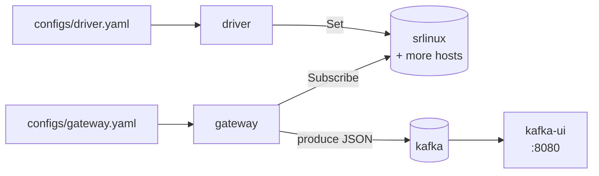
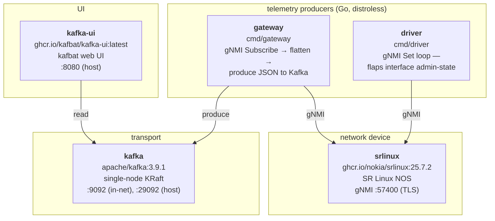

# gNMI → Kafka Demo

A self-contained docker-compose demo that streams gNMI telemetry from one or
more network devices into Kafka, viewable in a web UI. Each service owns its
own YAML config (k8s-ConfigMap-shaped), so you can deploy the gateway and the
driver independently and scale to multiple hosts by appending to one list.



## What's in the stack



## Quickstart

```sh
make up                            # docker compose up -d --build
make ps                            # watch services come healthy
open http://localhost:8080         # kafbat → cluster "demo" → topic "gnmi.telemetry"
```

⚠️ **SR Linux cold boot can take 5–15 min** on a developer laptop. The
healthcheck's `start_period` is set to 600 s. Subsequent boots (warm caches)
are much faster (~3 min). The gateway+driver have their own dial-retry, so you
can also bring them up before SR Linux is fully ready:

```sh
docker compose up -d --no-deps kafka kafka-ui srlinux       # core
docker compose up -d --no-deps gateway driver               # they will retry-dial
```

## Configuring

Each service owns its own file under [`configs/`](./configs):

### `configs/gateway.yaml`

```yaml
kafka:    { brokers: ["kafka:9092"], topic: gnmi.telemetry }
gnmi:     { port: 57400, username: admin, password: NokiaSrl1!,
            skip_verify: true, encoding: json_ietf, sample_interval: 5s }
paths:    [/interface[name=*]/admin-state, /interface[name=*]/oper-state, ...]
hosts:    [srlinux]
```

### `configs/driver.yaml`

```yaml
gnmi:     { port: 57400, username: admin, password: NokiaSrl1!,
            skip_verify: true, encoding: json_ietf }
hosts:    [srlinux]
flap:     { enabled: true, interval: 10s, interfaces: [ethernet-1/1] }
```

**Why two files?** So each service can be deployed/reconfigured independently.
In docker-compose each file is a bind-mount; in k8s each becomes its own
ConfigMap mounted into one Deployment. The two files duplicate `gnmi:` and
`hosts:` on purpose — keeping them coupled in a single file makes
deploy-per-service awkward.

**Scaling to multiple hosts:** add entries to `hosts:` in both files. The
gateway dials all hosts concurrently and the driver flaps all configured
interfaces on every host.

**Changing paths or interval:** edit `configs/gateway.yaml`, then
`docker compose restart gateway`. The file is bind-mounted, no rebuild needed.

**Pointing at a real device:** drop the `srlinux` service from
docker-compose.yml, put your device address in both files' `hosts:` lists,
and make sure the gateway container can route to it.

**Production / k8s:** move `gnmi.password` out of the YAML into a Secret
(env var, projected file, etc.) — the loader currently takes the password
verbatim from YAML, which is fine for a demo.

## Output format

One JSON record per leaf Update, keyed by the gNMI path:

```json
{
  "target":    "srlinux",
  "path":      "/srl_nokia-interfaces:interface[name=ethernet-1/1]",
  "value":     {"oper-state": "down"},
  "timestamp": "2026-06-26T08:10:01.234567890Z"
}
```

`target` matches the host string from `config.yaml`. `value` is the typed value
from the gNMI `TypedValue` oneof — scalars are JSON primitives, `JSON_IETF`
sub-trees pass through as objects.

## Useful commands

```sh
make logs                     # tail logs from all services
make tail-topic               # console-consumer dump of the first 50 records
docker compose logs -f gateway
docker compose logs -f driver
docker compose exec srlinux sr_cli      # SR Linux CLI inside the container
make down                     # tear it all down
```

## Project layout

```
.
├── configs/
│   ├── gateway.yaml          # ⭐ gateway config (k8s-ConfigMap shape)
│   └── driver.yaml           # ⭐ driver config (k8s-ConfigMap shape)
├── docker-compose.yml
├── Makefile
├── README.md
├── go.mod / go.sum
├── cmd/
│   ├── gateway/              # subscribe loop, one goroutine per host
│   │   ├── Dockerfile
│   │   └── main.go
│   └── driver/               # flap loop, one goroutine per (host, interface)
│       ├── Dockerfile
│       └── main.go
└── internal/
    ├── config/
    │   ├── config.go         # shared field types (Kafka, GNMI, Flap) + loader
    │   ├── gateway.go        # type + LoadGateway + validate
    │   └── driver.go         # type + LoadDriver + validate
    ├── gnmi/
    │   ├── client.go         # dial-with-retry, SubscribeRequest builder, Set
    │   └── flatten.go        # gNMI Notification → []Record (TypedValue cases)
    └── kafka/producer.go     # franz-go wrapper
```

## Notes & caveats

- **SR Linux gNMI listener lives in the `srbase-mgmt` Linux netns**, not the
  container's default netns. The healthcheck has to run via
  `sudo ip netns exec srbase-mgmt …` — that's already baked in.
- **TLS**: factory SR Linux uses a self-signed cert on 57400.
  `gnmi.skip_verify: true` is the demo-friendly setting. For plaintext gNMI,
  set `gnmi.insecure: true` (and configure an `insecure-mgmt` grpc-server on
  the device).
- **No persistence**: Kafka data lives in the container layer. `make down`
  wipes everything — by design for a demo.
- **Image pins**: `srlinux:25.7.2` and `kafka:3.9.1` are pinned; `kafka-ui`
  tracks `latest`. Bump in `docker-compose.yml` as needed.
